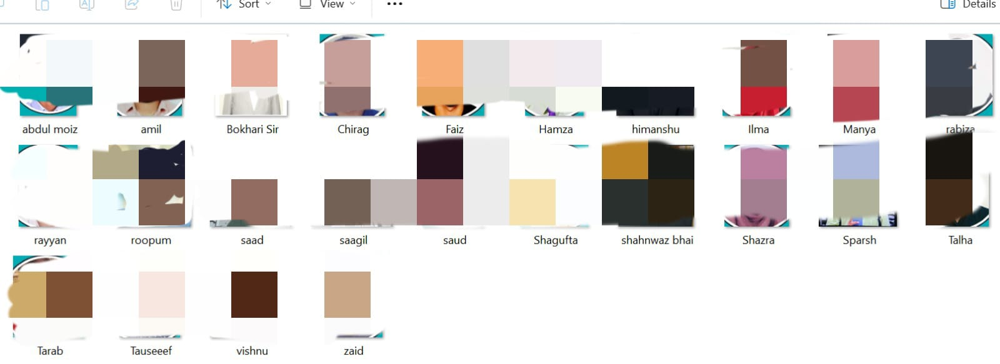
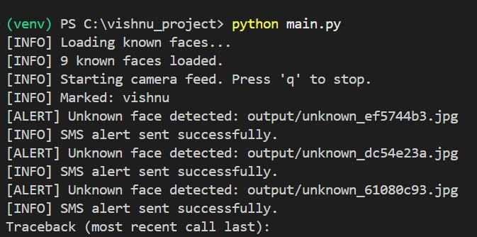
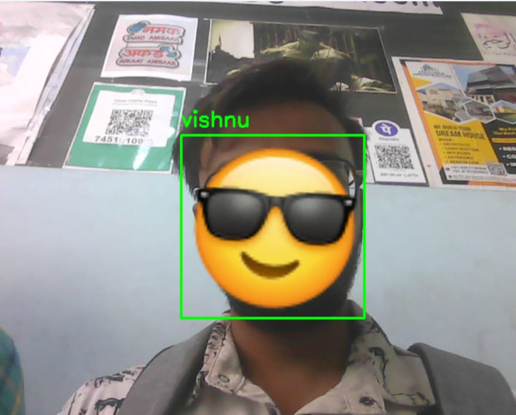
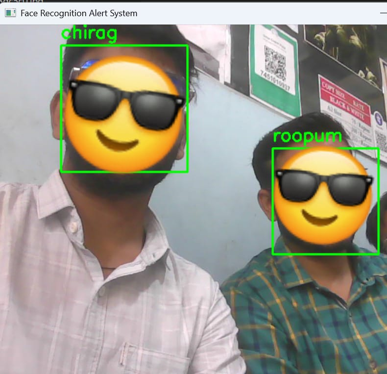

# Face-Recognition-Alert-System
A secure and contactless attendance system built using Python, OpenCV, and face_recognition. Features real-time facial recognition, spoof detection, CSV logging, and session recording. Designed for deployment in schools, offices, and secure zones with color-coded visual feedback and modular architecture.
# FaceGuard – Face Recognition Based Attendance System

> A secure, efficient, and contactless attendance automation system using real-time facial recognition with spoof detection.

---

## 📌 Overview

FaceGuard is an AI-powered attendance system that leverages real-time face recognition to automatically log attendance using a webcam. It replaces outdated manual and biometric methods with a modern, touch-free solution ideal for academic institutions, workplaces, and secure environments.

---

## 🚀 Features

- 🎯 **Real-Time Face Detection and Recognition**
- 🛡️ **Spoof Detection** (blocks screen/image impersonation using brightness & contrast analysis)
- 🧾 **Automatic CSV Logging** of recognized individuals (name + timestamp)
- 📹 **Session Recording** saved as video for verification/audit
- 🎨 **Visual Feedback** via color-coded bounding boxes:
  - ✅ Green → Known User
  - 🔵 Blue → Unknown Face
  - ❌ Red → Suspected Spoof
- ⚙️ Modular architecture for easy customization & deployment

---

## 🧑‍💻 Tech Stack

- **Language:** Python
- **Libraries:** `OpenCV`, `face_recognition`, `NumPy`, `datetime`, `os`, `csv`

---

## 📁 Project Structure

FaceGuard/
├── dataset/ # Stores images of known individuals
├── recordings/ # Video recordings of each session
├── logs/attendance.csv # CSV file logging attendance records
├── main.py # Main application file
├── encode_faces.py # Preprocess & encode known faces
└── README.md # Project documentation

---

## 🛠️ Setup Instructions

### 🔧 Prerequisites
- Python 3.8+
- Webcam

### 📦 Install Dependencies

```bash
pip install opencv-python face_recognition numpy
📂 Step 1: Add Known Faces
Place clear face images in the dataset/ folder.

File names should match the person's name (e.g., john_doe.jpg).
Step 2: Encode Faces
python encode_faces.py
Step 3: Run the App
python main.py


## 📸 Screenshots

### Add image data


### Terminal Snapshot


### Analyze user


### More output


### Warning


### Final output

